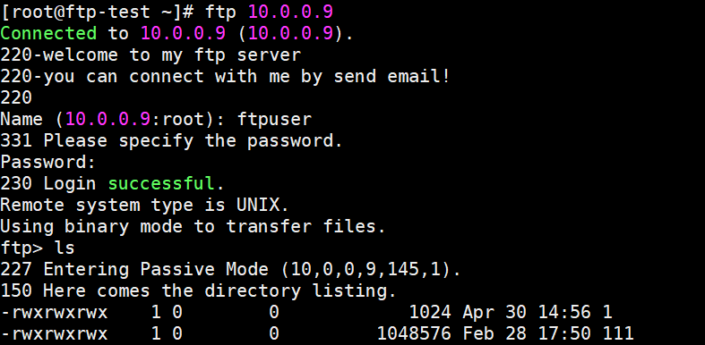
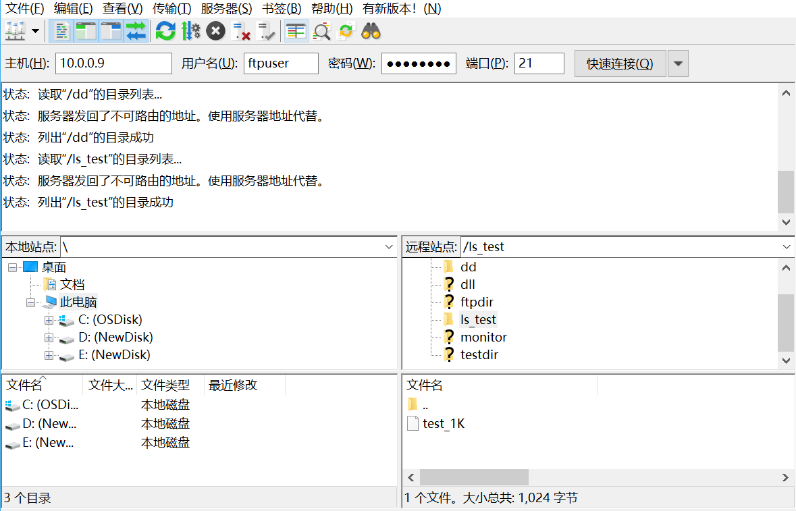

# 使用FTP访问

存储网关支持通过FTP协议访问Bucket挂载目录，各来访FTP客户端与存储网关需部署在同一个VPC下。

## 启动FTP Server
使用FTP Client连接前，需要提前部署存储网关，并启动FTP Server。流程如下：

**1. 部署存储网关**

部署存储网关，并启动存储网关文件共享服务，详情参考存储网关[部署说明](https://docs.jdcloud.com/cn/storage-gateway/installation-configuration)。

**2. 启动FTP服务**

FTP服务启动脚本路径为`/root/bin/ftpgw`，启动命令如下：
```
./ftpgw start
```

**3. 创建FTP登录用户**

使用FTP Client登录时，需要进行用户验证，且不支持匿名用户访问；因此需提前创建FTP用户，创建命令示例如下：
```
useradd -s /sbin/nologin <username>
passwd <username>
```
说明：
- useradd：创建用户，使用该用户登录FTP；
- /sbin/nologin：为了保证安全性，建议指定该参数，禁止用户通过ssh登入存储网关系统。
- passwd：为该用户设置密码。

注：
- 由于FTP为明文传输，公网使用可能导致安全风险；强烈建议您将存储网关与FTP Client部署在**同一VPC**下，并使用内网IP访问。
- FTP Server支持多个Client同时登录访问；当多个Client同时操作一个文件时，后操作会覆盖先前的操作。

## Linux下使用FTP访问存储网关
**1. 安装FTP Client**

使用以下命令安装FTP Client。
```
yum install ftp
```
**2. 登录FTP**
```
ftp <IP>
```
说明：
 - IP：存储网关内网ip；
 - 用户名及密码：连接后输入用户名及密码（FTP Server创建的用户）完成登录。

登录成功后，即可访问FTP共享目录，如下图：


**3. 使用FTP**

支持的FTP命令：
- put
- get
- rename
- delete
- mkdir
- ls
- cd
- bye
- quit
- size

不支持FTP命令：
- mput
- mget
- append

## Windows下使用FTP访问存储网关

Windows下提供多种FTP客户端，以下以FileZilla为例访问FTP Server。

**1. 安装FileZilla**

下载[FileZilla](https://filezilla-project.org/)并安装。

**2. 登录FTP**

使用FileZilla登录FTP需要配置以下内容：

- 主机：存储网关内网ip；
- 用户名及密码：FTP Server上创建的FTP登录用户
- 端口：21

登录成功后，即可使用FTP进行上传下载，如下图：



## 停止/重启FTP服务

FTP服务脚本路径为`/root/bin/ftpgw`，停止/重启命令如下：
```
./ftpgw stop    #停止ftp服务
./ftpgw restart    #重启ftp服务
```
