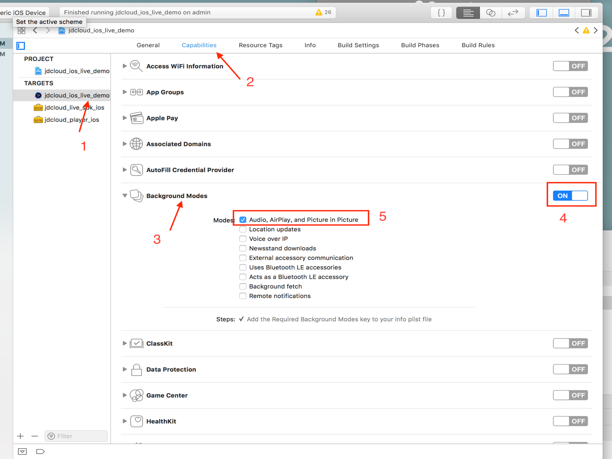

## SDK的使用  

**推流SDK的基本使用流程**   

1、创建播放器接口类  
2、初始化播放器的默认参数  
3、添加播放器试图到需要的界面上  
4、设置播放视频的URL  
5、准备播放  
6、注册播放器代理，接收 播放中状态   
下面按照步骤分别介绍具体使用方法：  

**1.创建播放器接口类** 

JDCloudPlayer类，为播放器SDK的核心类，提供播放器开始、暂停、重播、seek等等功能。
引入头文件#import < JDCloudPlayerFramework
/JDCloudPlayer.h >      
```
  @property (nonatomic, strong) JDCloudPlayer *jdCloudPlayer;    
```
初始化底层播放器。示例代码如下：
```
self.jdCloudPlayer = [[JDCloudPlayer alloc]init];
```  
**2.初始化播放器默认参数**  
JDCloudOptionModel类配置播放器的默认参数，每个属性参数有一个对应的默认值，关于默认值和参数范围，参见JDCloudOpti onModel类提供的属性和方法。
初始化默认系统参数，播放前设置。  
```
JDCloudOptionModel *model = [[JDCloudOptionModel alloc] init];
```
其他播放参数设着，播放前后均可设置，接口示例代码如下：  
```
//是否开启多码率网络自适应
 self.jdCloudPlayer.adaptivePlayback = YES;
//是否纯音频播放
self.jdCloudPlayer.isOnlyAudio = YES;
//是否镜像
self.jdCloudPlayer.isMirrorPlay = YES;
//是否后台播放
self.jdCloudPlayer.isPlayOnBackGroud = YES;
//缩放模式 默认填充
self.jdCloudPlayer.scalingMode = JDCloudScalingModeAspectFit;
```  
**3.视频播放页面加入当前View**    
```
[self insertSubview:self.jdCloudPlayer.playerView atIndex:0];
```                                                                                
**4.设置播放视频的URL**  
填写播放地址，播放器SDK支持RMVB、AVI、MKV、MP4、MOV等格式。
```
//第一次准备播放设着URL
[self.jdCloudPlayer setVideoWithURL:url withPlayerOption:model];
//重设URL
[self.jdCloudPlayer resetWithUrl:url withPlayerOption:model];
```  
**5.准备播放**  
```
 [self.jdCloudPlayer prepareToPlay];
 ```  
**6.注册播放器代理事件**  
引入<JDCloudPlayerDelegate>播放器回调代理
```
 self.jdCloudPlayer.delegate = self;
 ```         
 播放器回调有二个，注册delegate可接受对应的回调，代码如下：
```
//播放过程中状态发生改变
- (void)vodPlayer:(JDCloudPlayer *)vodPlayer onEventCallback:(JDCloudPlayerEvent)event；

//播放时发生错误的回调信息
- (void)vodPlayer:(JDCloudPlayer *)vodPlayer playBackErrorModel:(JDCloudPlayerVideoErrorModel *)errorModel; 
```  

示例代码如下：
```
//播放过程中状态发生改变
- (void)updateVodPlayViewDataWithEvent:
(JDCloudPlayerEvent)event vodPlayer:(JDCloudPlayer *)vodPlayer{
    switch (event) {
/*! 准备成功*/
    case  JDCloudPlayerEventPrepareDone = 0,
    /*! 开始播放*/
    case  JDCloudPlayerEventPlay,
    /*! 视频开始向前*/
    case  JDCloudSeekVideoStart,
    /*! 音频开始向前*/
    case  JDCloudSeekAudioStart,
    /*! 第一帧加载完成*/
    case  JDCloudPlayerEventFirstFrame,
    /*! 暂停播放*/
    case  JDCloudPlayerEventPause,
    /*! 停止播放*/
    case  JDCloudPlayerEventStop,
    /*! 播放已结束*/
    case  JDCloudPlayerEventFinish,
    /*! 开始加载视频数据*/
    case  JDCloudPlayerEventBeginLoading,
    /*! 视频资源加载完成*/
    case  JDCloudPlayerEventEndLoading,
    /*! 跳转成功*/
    case  JDCloudPlayerEventSeekDone,
    /*! 播放被中断*/
    case  JDCloudPlayerEventInterrupted,
    /*! 向前跳转*/
    case  JDCloudPlayerEventSeekingForward,
    /*! 向后跳转*/
    case  JDCloudPlayerEventSeekingBackward
    }
}

//根据错误信息，展示popLayer界面
- (void)showPopLayerWithErrorModel:
(JDCloudPlayerVideoErrorModel *)errorModel{
switch (errorModel.errorCode) {
// 未知错误
      case 0:
// 当网络超时进行提醒（文案统一可以定义），用户点击可以进行重播。      当前网络不佳，请稍后点击重新播放
      case 4008:
      // 当视频加载出错时进行提醒，点击可重新加载。   视频加载出错，请点击重新播放
      case 4005:
       // 服务器返回错误情况
        default:
            break;
    }
}
```  
**7.结束播放**  
结束播放后，播放器播放状态改为stop即可  
```
//停止播放
[self.jdCloudPlayer stop];
```  

## 更多接口    

在播放过程中，可以进行一下功能的设置，设置接口在JDCloudPlayer类中有详细备注，详细解释和示例代码如下： 
    
* **播放器的各种控制**  
播放器的控制接口，基本控制功能有播放、停止、暂停、恢复、重播、Seek。其中Seek功能仅对点播有效。  
```
//播放
[self.jdCloudPlayer play];
//停止，在开始播放之后调用
[self.jdCloudPlayer stop];
//暂停
[self.jdCloudPlayer pause];
//暂停后恢复播放
[self.jdCloudPlayer resume];
//重新播放上一次url地址视频
[self.jdCloudPlayer replay];
//跳转到指定时间点的视频画面，秒
[self.aliPlayer seekToTime:1.5];
```  
* **缩放模式**    
视频画面的填充模式，如裁剪、填充、全屏等效果；通过scalingMode属性来设置／获取当前所放模式，播放前或者播放中设置均生效  
```
typedef NS_ENUM(NSInteger, JDCloudScalingMode) {
    /*! 不改变比例*/
    JDCloudScalingModeNone,
    /*! 填充 统一尺度直到宽高某一条件匹配*/
    JDCloudScalingModeAspectFit,
    /*! 剪裁 统一尺度直到，画面填充满可见的边界。宽或高的内容可能被剪切*/
    JDCloudScalingModeAspectFill,
    /*! 全屏 不统一尺度，宽高完全匹配设置的区域，画面可能被拉伸*/
    JDCloudScalingModeFill
};
```  

代码示例：
```
switch (button.tag) {
        case 300:{   //填充
            self.jdCloudPlayer.scalingMode = JDCloudScalingModeAspectFit;
        }
            break;
        case 301:{ //裁剪 
            self.jdCloudPlayer.scalingMode = JDCloudScalingModeAspectFill;
        }
            break;
        case 302: {   //全屏 
            self.jdCloudPlayer.scalingMode = JDCloudScalingModeFill;
        }
            break;
```  

* **倍速播放**  
在播放器创建之后，可设置倍速，播放中也可以设置，仅点播可用，倍速播放支持0.5～2倍的设置。  
```
self.jdCloudPlayer.playRate = 0.5;    
 ```     
* **清晰度切换**  
在播放器创建之后，可设置清晰度，播放中也可以设置，仅点播可用，支持高清、超清、标清。  
```
typedef NS_ENUM(NSInteger, JDCloudPlayerClaritType) {
    /*! 流畅*/
    JDCloudMPMovieClaritTypeSD,
    /*! 标清*/
    JDCloudMPMovieClaritTypeCIF,
    /*! 高清*/
    JDCloudMPMovieClaritTypeHD,
};
```  
代码示例：
```  
switch (button.tag) {
        case 300:{   //超清
            self.infoModel.claritType = JDCloudMPMovieClaritTypeHD
        }
            break;
        case 301:{ //高清 
            self.context.infoModel.claritType = JDCloudMPMovieClaritTypeCIF;
        }
            break;
        case 302: {   //标清
            self.context.infoModel.claritType = JDCloudMPMovieClaritTypeSD;
        }
            break;
```  
* **播放进度和时间**  
播放器中显示的当前时间和播放的总时长，在准波播放成功后，可以获取。   
示例代码：  
```
//当前播放时间
NSTimeInterval currentTime = self.jdCloudPlayer.currentPlayerTime
//总时长
NSTimeInterval durationTime = self.jdCloudPlayer.duration
 //计算当前播放进度
 Float progress = currentTime / durationTime;
```  
* **镜像播放**  
镜像功能可使播放的画面左右镜像翻转。示例代码：  
```
self.jdCloudPlayer.isMirrorPlay = YES;
```  
* **后台播放**  
当用户点击home按钮后，播放器进入后台继续读取数据并播放音频。当APP回到前台后，音频继续播放。  
参考下图设置：Target-Capabilities-Background Modes 打开，选择Audio，AirPlay and Picture in Picture选项即可。   

* **纯音频播放**  
设置播放过程中有无画面输出，设置该属性为YES后，底层不再进行视频的渲染动作。播放前后均可设置。  
```
self.jdCloudPlayer.isOnlyAudio = YES;
```  
* **截图当前正在播放的图像**  
获取当前播放器时间点播放图片。  
```
UIImage *image = [self.jdCloudPlayer thumbnailImageAtCurrentTime];
```  
* **播放器过程中音量和亮度控制（系统）**   
```
//初始化系统音量空间 设置音量
self.volumeView = [[MPVolumeView alloc] init];
self.systemVolume = self.volumeSlider.value;
//亮度控制
[UIScreen mainScreen].brightness += 0.01;
```  
* **URL播放视频**  
重设播放器的URL。  
```
if (self.jdCloudPlayer && self.jdCloudPlayer.playerView) {
        [self resetPlayWithUrl:self.playUrl];
 }
```  
* **截gif和小视频**  
截取gif和小视频时，先把视频下载到本地，选取截的视频的开始时间和结束时间。  
```
/* 
* 截取小视频
* videoPath  视频下载在本地地址
  destPath   小视频将要存本地的地址
  width       小视频的宽度
  start       开始时间
  end         结束时间
  recordVideoFinished  完成回调
/
+ (void) recordVideo: (NSString*)videoPath
            destPath: (NSString*)destPath
          imageWidth: (NSInteger)width
           startTime: (NSInteger)start
             endTime: (NSInteger)end
            progress: (JDCloudProgressBlock)blockrecordVideoFinished:(JDCloudRecordVideoFinishedBlock)recordVideoFinished

//截取生成gif
+ (void) recordGif: (NSString*)videoPath
          destPath: (NSString*)destPath
             width: (NSInteger)width
               fps: (CGFloat)frames
          duration: (NSInteger)duration
         startTime: (NSInteger)startTime
          progress: (JDCloudProgressBlock)block
 recordGifFinished:(JDCloudRecordGifFinishedBlock)recordGifFinished
```  
* **边播边缓存功能**  
边播边下缓存功能是在视频被成功播放后，文件会缓存到本地，再次播放视频时会直接使用本地缓存文件，不再走网络请求。  
```
//取当前播放视频URL
NSString *playUrl = [self.cacheSingleton getProxyUrl:self.playUrl.absoluteString];
//预下载
[self.cacheSingleton preDownload:playerUrlStr];
```  
* **日志**   
播放过程中状态发生改变，获取不同播放状态和播放信息作为日志。  
```
//播放过程中状态发生改变
- (void)updateVodPlayViewDataWithEvent:(JDCloudPlayerEvent)event vodPlayer:(JDCloudPlayer *)vodPlayer 
```  

