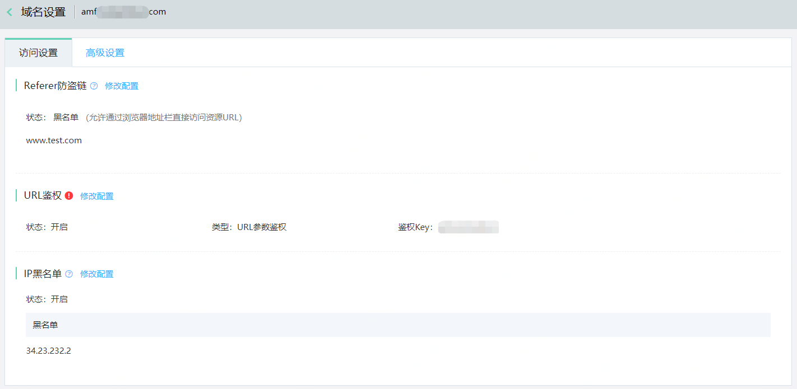
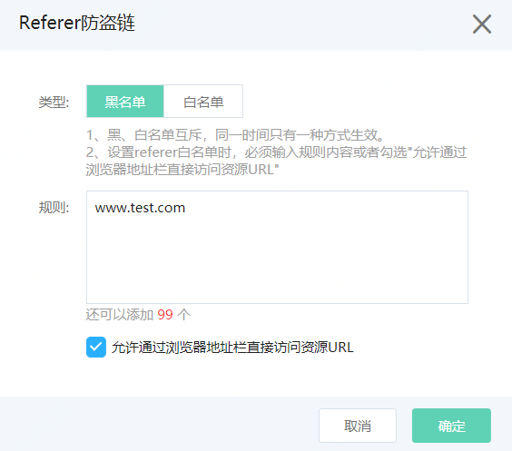
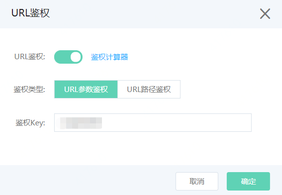
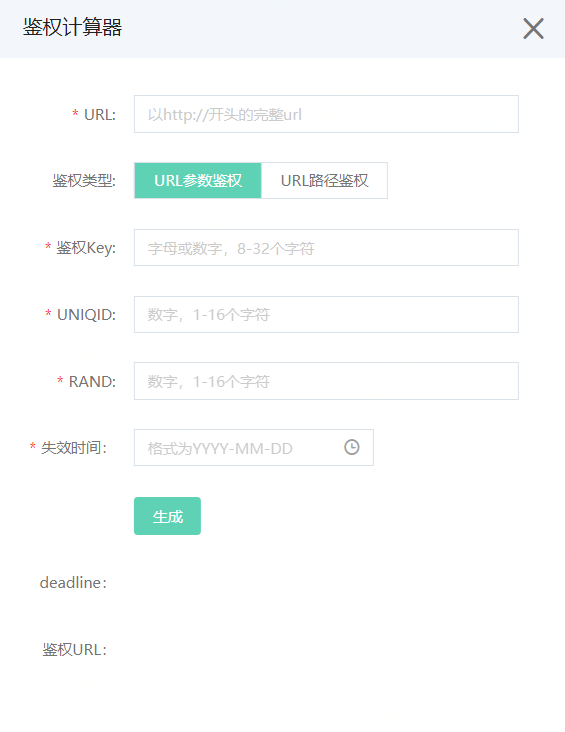
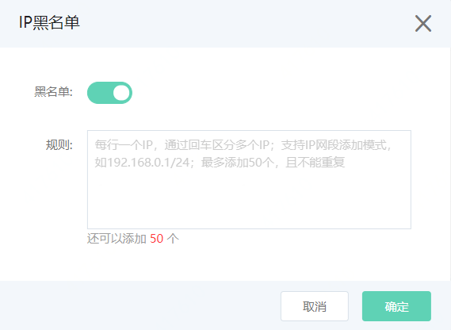

# 全局设置

## 1.转码设置
登录视频点播控制台，点击左侧菜单栏“视频点播”-“全局配置”-“转码设置”，进入转码配置页面，可以点击“添加转码模板”，添加新的转码模板。对于已有的转码模板，可在模板列表中点击“编辑”，进入模板编辑页面，修改模板中的视频音频参数。

模板编辑界面如下：

## 2.水印设置
登录视频点播控制台，点击左侧菜单栏“视频点播”-“全局配置”-“水印设置”，进入“水印设置”，可以点击“添加水印模板”，添加新的水印模板。对于已有的水印模板，可在模板列表中点击“编辑”，进入模板编辑页面，修改模板中的水印参数。

## 3.分类设置
登录视频点播控制台，点击左侧菜单栏“视频点播”-“全局配置”-“分类设置”，进入分类配置页面，可以增加分类、添加子分类。

## 4.域名设置
### 4.1 域名添加
京东云默认为客户提供一个默认域名，如果需要修改，您可以通过域名设置，添加您经过备案的域名并设为默认，还可以进行启用、停用、删除等操作。启用中的域名首先需要停用才可删除，否则不能删除。

在添加了自定义域名后，客户需要到购买域名的服务商处做cname绑定操作，才能正常解析使用域名，具体操作步骤请参考各个域名服务商操作指南。
   
### 4.2 访问控制

点播产品支持对播放域名安全相关的配置，在域名设置界面，点击想要配置的域名，会进入域名“访问设置”页面。

**A.Referer防盗链**

通过配置访问的referer黑白名单来对访问者身份进行识别和过滤，从而限制资源被访问的情况，点击Referer防盗链后面的修改配置选项，在弹出的窗口中进行规则配置。

**B.URL鉴权**

高级防盗链功能，通过设置鉴权KEY对URL进行加密，充分保护源站资源，点击URL鉴权后面的修改配置选项，在弹出的对话框中根据需要进行配置，其中鉴权详细说明可参考4.3中内容，另外开启鉴权功能后需要注意以下两点：

1.在开启key防盗链后，原始URL将无法用于播放，请根据4.3章节中内容详细介绍，生成带鉴权的URL进行播放

2.开启URL鉴权后，hls格式暂时在控制台无法预览播放

**C.IP黑名单**

通过黑名单来对访问者身份进行识别和过滤，添加到黑名单的IP，将无法访问当前加速域名。

### 4.3 URL鉴权说明

URL鉴权支持参数和路径两种鉴权方式，用户可以根据自己的业务情况，选择合适的鉴权方式，来实现对源站资源的有效保护。

**A.参数鉴权方法**

1 加密 URL 构成

http://DomainName/Path/Filename?参数&auth_token=expire-uniqid-rand-signature

signature =md5sum("uri-expire-uniqid-rand-private_key")

2 鉴权字段描述

|字段|描述|
|-|-|
|expire|失效时间，10位整型整数|
|uniqid|整型，随机数，唯一id，不使用时设置成0即可。该字段可以用来标记身份或业务，用户可自行设定|
|rand|整型，随机数，一般设置成0，可以使用生成token时的时间戳作为rand|
|signature|字符串，通过md5算法计算出的验证串，数字和小写英文字母混合0-9a-z，固定长度32，不区分大小写|
|uri|是用户的请求对象相对地址，不包含参数|
|private_key|用户自定义的秘钥（8-32个字符）|

3 原理说明

CDN服务器拿到请求后，首先会判断请求中的 expire 是否小于当前时间，如果小于，则认为过期失效并返回HTTP 403错误。如果 expire 大于当前时间，则构造出一个同样的字符串(参考以下signature构造方式)。然后使用MD5算法算出 new_signature ，再和请求中带来的 signature 进行比对。比对结果一致，则认为鉴权通过，返回文件。否则鉴权失败，返回HTTP 403错误。

new_signature 是通过以下字符串计算出来的：

origin_signature = "uri-expire-uniqid-rand-private_key "（uri是用户的请求对象相对地址，不包含参数）

new_signature = md5sum(origin_ signature)

4 示例说明

通过请求对象:
http://cdn.example.com/video/standard/1K.html?fa=121&jd=121

密钥设为：jdcloud1234 (由用户自行设置)

鉴权配置文件失效日期为：2020年06月18日00:00:00,计算出来的秒数为1592409600

则CDN服务器会构造一个用于计算signature的签名字符

/video/standard/1K.html-1592409600-0-0-jdcloud1234

CDN服务器会根据该签名字符串计算signature:
signature = md5sum("/video/standard/1K.html-1592409600-0-0-jdcloud1234") =06d97bc9e43ded48d991994006cfa127

则请求时url为：
http://cdn.example.com/video/standard/1K.html ?fa=121&jd=121&auth_token=1592409600-0-0-06d97bc9e43ded48d991994006cfa127

计算出来的 signature 与用户请求中带的 signature =06d97bc9e43ded48d991994006cfa127值一致，于是鉴权通过。

**B.路径鉴权法**

1 加密 URL 构成

http://DomainName/deadline/ md5sum("uri-deadline-password")/Path/Filename?参数

2 鉴权字段描述

|字段|描述|
|-|-|
|deadline|失效时间，10位整型整数|
|uri|是用户的请求对象相对地址，不包含参数|
|password|用户自定义的秘钥（8-32个字符|
|md5hash|通过md5算法计算出的验证串，数字和小写英文字母混合0-9a-z，固定长度32，不区分大小写|

3 原理说明

CDN服务器拿到请求后，首先会判断请求中的 deadline 是否小于当前时间，如果小于，则认为过期失效并返回HTTP 403错误。如果 deadline大于当前时间，则构造出一个同样的字符串(参考以下sstring构造方式)。然后使用MD5算法算出 HashValue ，再和请求中带来的 md5hash 进行比对。比对结果一致，则认为鉴权通过，返回文件。否则鉴权失败，返回HTTP 403错误。

HashValue 是通过以下字符串计算出来的：

sstring = "uri-deadline-Password" （uri是用户的请求对象相对地址，不包含参数）

HashValue = md5sum(sstring)

4 示例说明

通过请求对象:
http://cdn.example.com/video/standard/1K.html ?fa=121&cc=121

密钥设为：jcloud1234 (由用户自行设置)

鉴权配置文件失效日期为：2020年06月18日00:00:00,计算出来的秒数为1592409600

则CDN服务器会构造一个用于计算Hashvalue的签名字符

/video/standard/1K.html-1592409600-jcloud1234"

CDN服务器会根据该签名字符串计算HashValue:
HashValue = md5sum("/video/standard/1K.html-1592409600-jcloud1234") = 8afb0900782e14c35214ccda534a3679

则请求时url为：
http://cdn.example.com/1592409600/8afb0900782e14c35214ccda534a3679/video/standard/1K.html? fa=121&cc=121

计算出来的HashValue与用户请求中带的 md5hash = 8afb0900782e14c35214ccda534a3679 值一致，于是鉴权通过。

## 5.回调设置
视频点播支持任务完成的消息订阅。客户如需获取视频上传完成、转码完成的消息通知，可在回调设置中设置回调URL及回调事件，相关事件会通过客户填写的URL及时通知到客户。

